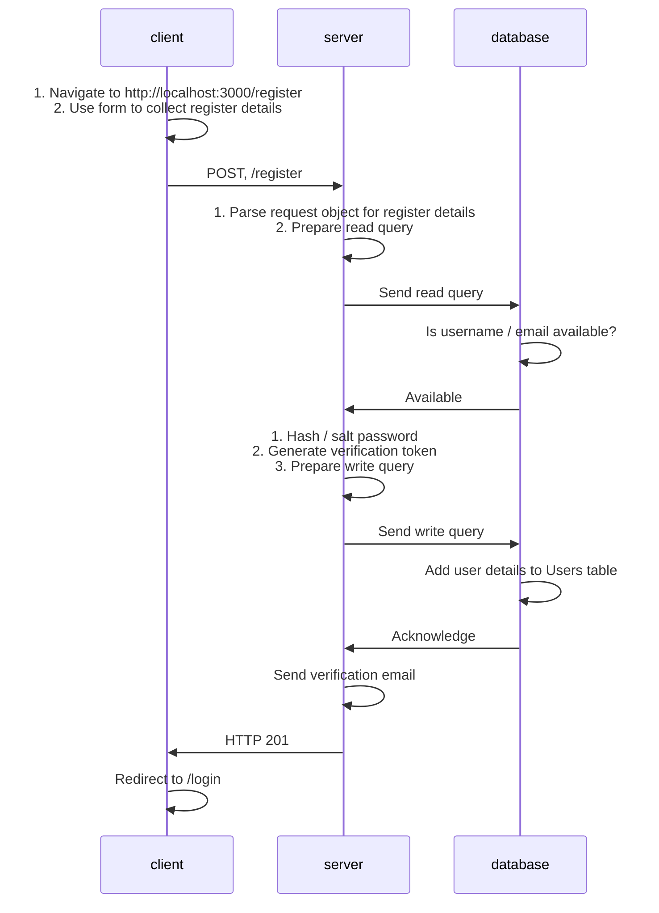
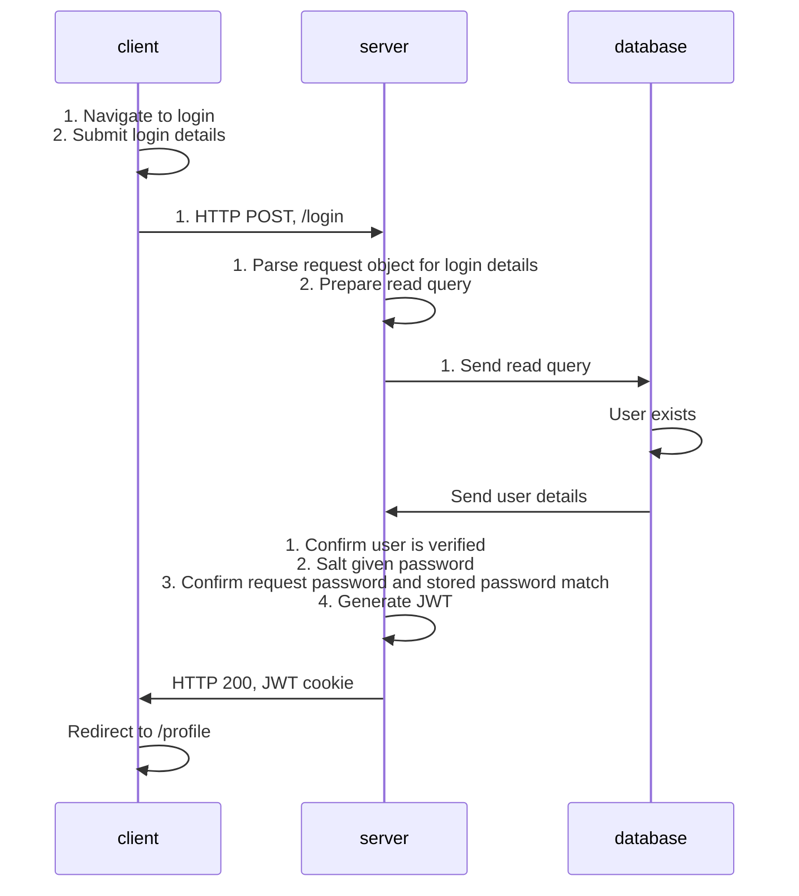
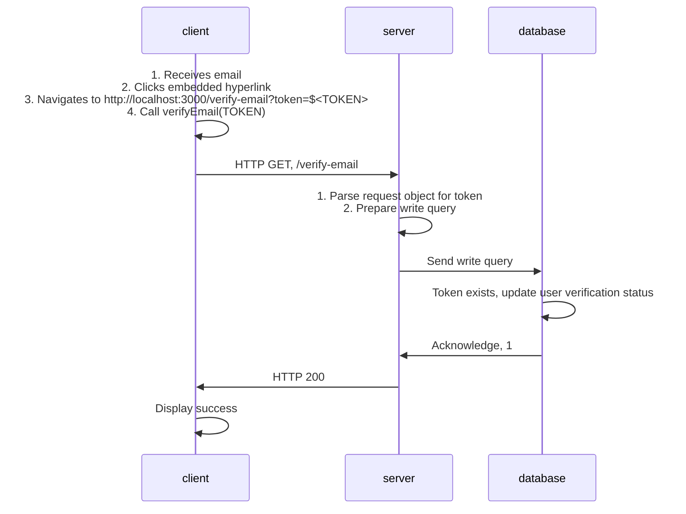

# Journey

### Overview
This document provides a high level summary of various features within this application. 

## `/register`

### Details
Diagram models technical details for creating an account implementation

### Daigram

## `/login`

### Details
Diagram models technical details for login implementation

### Daigram

## `/verify-email`

### Details
Diagram models technical details for email verification implementation

### Diagram

